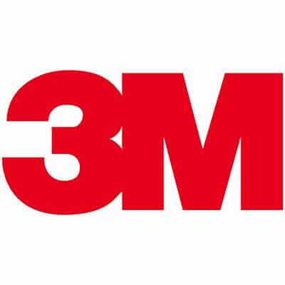

# Land-It Prototype

Access to web app at http://land-it-prototype.herokuapp.com/

#### What is the Land-It Prototype?
The Land-It is a student built prototype of a Post-It note printer sponsored by 3M.
This GitHub hosts all of the programming we used for hosting our IOT web app and running the printer.
###### TODO
- [ ] Add architecture documentation
- [x] Host web app
- [x] Connect web app to printer
- [ ] Upload PNG feature
- [ ] Convert PNG to G-Code
- [ ] Connect to Line-Us without wifi and still send G-Code
